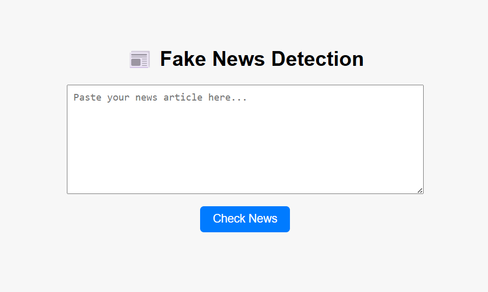

# Fake News Detector

A machine learning project to detect **fake news** using **TF-IDF features** and **Logistic Regression**. Includes a **Flask web app** for real-time news verification.

---


## ✨ Features

- Detects Fake vs Real News using TF-IDF & Logistic Regression

- Cleans and preprocesses text automatically

- Multiple training iterations to select the best model

- Flask web app for real-time predictions

- Shows confidence score for each prediction

- Modular pipeline: preprocessing → feature extraction → model training

---

## ⚙️ Installation

1. Clone the repository:

```bash
git clone <[your-repo-url](https://github.com/thulasihanelitchelvan/fake-news-detector)>
cd FakeNews-Detector
```

2. Add the dataset files to the data/ folder:


- Download from: [Kaggle Fake News Dataset](https://www.kaggle.com/datasets/clmentbisaillon/fake-and-real-news-dataset)


- Place fake.csv and true.csv in data/

- Rename true.csv → real.csv (for consistency with project scripts)


3. Create a virtual environment (optional but recommended):

```bash
python -m venv venv
# Windows
venv\Scripts\activate
# Linux / macOS
source venv/bin/activate
```

4. Install dependencies:

```bash
pip install -r requirements.txt
```

5. Run the project scripts in order:

```bash
python preprocessing.py          # Clean raw data
python feature_extraction.py     # Extract TF-IDF features
python model_training.py         # Train the model
python app.py                    # Launch the Flask app

```


## App Preview

Here’s a screenshot of the Fake News Detector web app:




